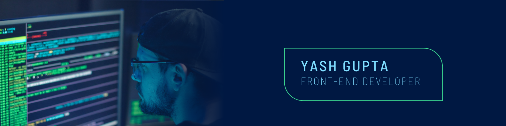

<h1 align="center">Hello, World! 🌍 I'm Yash Gupta, the Architect of the Web 🚀</h1>
<h3 align="center">A passionate frontend developer from India</h3>
<h4>👨‍💻 About Me</h4>

Welcome! I’m a Frontend Engineer blending creativity with code. From HTML & CSS foundations to React-powered apps, I focus on building engaging interfaces that bring ideas to life and make the web a little more delightful.

  

- 🌱 **Currently exploring:** Node.js & Full-Stack Development

- 👨‍💻 Projects portfolio: [My Universe](https://yashgupta-dev.netlify.app/)

- 💬 Let’s talk about: **JavaScript & React**

- 📫  **Reach me at:** [itsyashgupta64@gmail.com](mailto:itsyashgupta64@gmail.com)

- 📄 Experience & journey: [Yash Gupta](https://drive.google.com/file/d/1yMB3rfzgAKkHGI0hABNWG9WUMe5TrPup/view?usp=sharing)

- ⚡ Fun fact **I think I am who I am**

<h3 align="left">Connect with me:</h3>

    
    
    

<h2>💡 What I Bring to the Table</h2>
<ul>
  <li><strong>Languages:</strong> HTML, CSS, JavaScript</li>
  <li><strong>Frameworks/Libraries:</strong> React, Next.js</li>
  <li><strong>Tools & Platforms:</strong> Git, npm, Azure DevOps</li>
  <li><strong>Strengths:</strong> Transforming wireframes into polished UIs, debugging with precision, and delivering seamless user experiences</li>
</ul>

 <!-- <h3 align="left">Languages and Tools:</h3> -->

 <!-- Updated Tech Stack Icons -->
 
 
 
 
 
 
 
 
 
 
 
 
 

 
 
 
 
 
 
 
 
 

